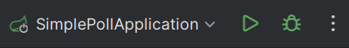
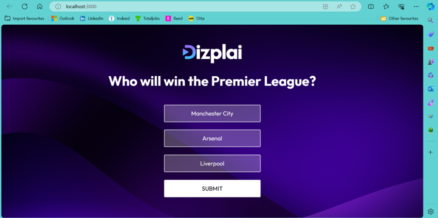
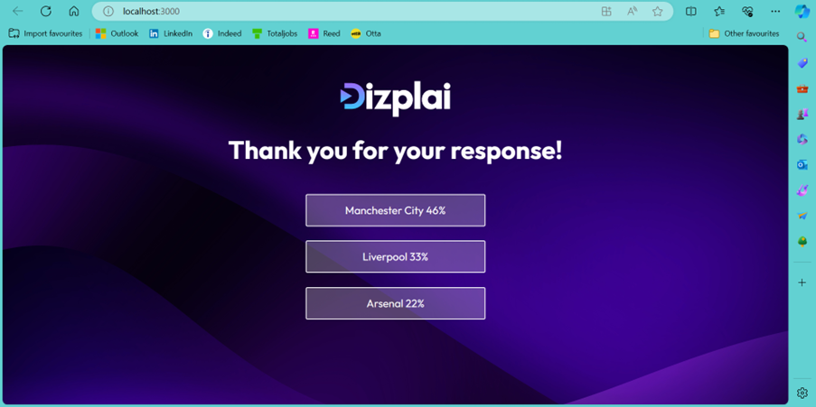
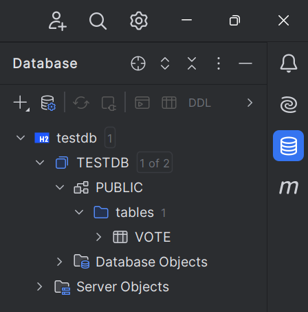
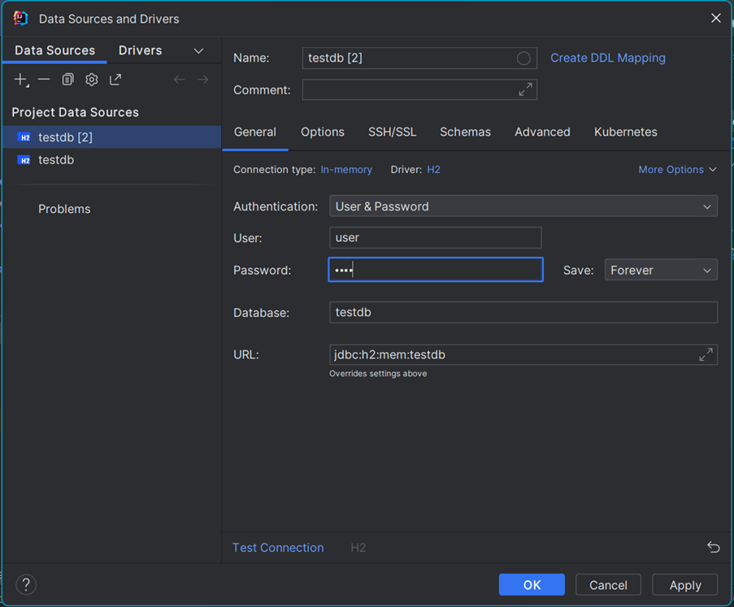
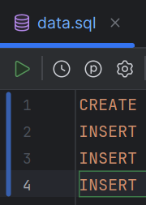

# Technical Test
I used React to build the frontend of the application and Spring Boot to build the backend. It uses a RESTful API to connect them. I used this stack because I have used it before and was familiar with how it worked. However, I encountered difficulties along the way due to the fact that I was relying on an old project to help build the application, as well as sources from the internet, but some of the modules I used had been updated and no longer used the same names/methods. The application is incomplete but the required functionality is implemented/implied.
## React Frontend
I used VSCode to build the React frontend.
To run, I opened a terminal, changed the directory to simple-poll and used:
```bash
npm start
```
## Spring Boot Backend
I used IntelliJ to build the Spring Boot backend. 
To run, I used the built in 'Run' feature:



## Web App
As mentioned, I had some difficulties along the way and this included routing, therefore the Voting and Confirmation pages have to be hardcoded to view. React and react-router-dom have been updated since I last used them and I wasn't able to figure out how to implement routes in the application I built. I have not included the files I used to try and implement this as they interfere with the running of the application.
### The Voting Page
To view the Voting page, make sure that the following in index.js reads as:
```bash
const root = ReactDOM.createRoot(document.getElementById('root'));
root.render(
  <React.StrictMode>
    <VotingPage />
  </React.StrictMode>
);
```
It displays the provided example poll and its options and allows a user to select a vote and submit* it. It shows which option a user has selected using CSS, only one option can be selected at a time, and the user is prevented from submitting without selecting an option (a warning message appears as a result). 

*When the submit button is pressed, the page will not change. As mentioned, there were complications with routing. However, the user's vote is successfully sent to the server and this can be seen in the console.log: on submission, the user's vote is sent to the server and the server responds by sending back the id of the vote they cast.



### The Confirmation Page
To view the Confirmation page, make sure that the following in index.js reads as:
```bash
const root = ReactDOM.createRoot(document.getElementById('root'));
root.render(
  <React.StrictMode>
    <ConfirmationPage />
  </React.StrictMode>
);
```
It displays the contents of the following JSON file, votes.json (which can be found in the backend files):
```bash
{
  "pollId": 1,
  "totalVotes": 79,
  "results": [
    {
      "optionId": 1,
      "optionText": "Manchester City",
      "votes": 36
    },
    {
      "optionId": 2,
      "optionText": "Arsenal",
      "votes": 17
    },
    {
      "optionId": 3,
      "optionText": "Liverpool",
      "votes": 26
    }
  ]
}
```
The results are ordered by the most popular to the least popular (which can be observed by changing the votes in the JSON file) and the percentages of the votes are also displayed to the nearest integer. 



## Server
Another difficulty I had was storing the values of polls and votes. I thought I would be able to store the results of the polls in JSON files too, however I could not find a way to update/modify the JSON file. The application currently uses a fake JSON data set to display the poll results on the Confirmation Page. I tried to implement an in-memory H2 database but did not have enough time to complete it. The development for that is available to view and code is commented out. 

The application is able to do all of the following three through the API, but Post A Vote and Get Votes does not fully work.
### Get A Poll
The application can successfully display the provided example poll. However, an assumption is made that the JSON file contains only one poll. This could be solved by specifying the poll ID when getting the poll.
### Post A Vote
The application can successfully send the option ID of the user's vote from the frontend to the backend, however the vote is not saved and is therefore not included in the results on the Confirmation Page. The assumption again is that there is only one poll, which can be solved by including the poll ID when posting the option ID through. 

There is commented out code showing the attempt to use an in-memory database to manage the votes including using the poll ID to rectify the single poll assumption. Also in the commented code is error handling to through the isPresent() method. This, if implemented successfully, would prevent a person from voting on a poll that doesn't exist by throwing en error when the non-existant poll is not found (not present).
### Get Votes
The application can successfully display the example results from votes.json. There is commented out code showing the attempt to use an in-memory database to find the poll results and post them. Also in the commented code is error handling to through the try and catch method.
## Testing
I was only able to complete manual unit and integration tests since the application does not use routing and does not work as a whole. It did not require much testing, therefore tests were only performed to determine if the correct output was given in the console.log, e.g., in VotingPage.js, there is still one line that shows the correct vote is passed between the frontend and the server:
```bash
console.log("Vote: " + response.data);
```
# Update (Fixes and Changes)
## Fix Routing
The routing has been fixed. The issue I had was that I have used class components instead of functional components for my application and the latest version of react-router-dom doesn't allow hooks to be used in class components. Instead of rewriting the entire project or downgrading react-router-dom, I found a fix, but it would be much better to implement react-router-dom's useNavigate instead.

To note, when the application is run for the first time, the confirmation page requires refreshing to display the updated table values. If you then go back to the voting page and vote again, the confirmation page will be correct and will not need refreshing. It only happens on the first vote.
## Implement In-Memory H2 Database
The in-memory H2 database has been implemented. Currently, there is only one table which contains the votes with a poll_id, option_id and number of votes (there is also a primary key ID which, if the test was a real scenario, would not be needed since poll_id and option_id would act as foreign and composite keys). The following is required to set up the database:



On the right hand side of IntelliJ, click the database symbol, then click the plus symbol and select Data Source --> H2. This will bring up the following configuration window:



Enter the details as can be seen in the image above. Test the connection works then click OK. Then run the data.sql file in the resources folder using the green arrow that appears when opening it:



This should have initialised the database. You can check by opening the newly created vote table in the database menu, and when running the backend server, go to the following URL to view and query the table:
http://localhost:8080/h2-ui

## Error Handling
With the implementation of the in-memory H2 database, more error handling has been added for the following:
### Post A Vote
If, somehow, the user managed to POST with an invalid poll ID or option ID, the database would return a null value and the server would send a NOT_FOUND HTTP status. 
### Get Votes
If, somehow, the user managed to GET with an invalid poll ID, the database would return an empty list and the server would send a NOT_FOUND HTTP status.
### Get Poll
As mentioned before, the database only has one table. However, if the poll was stored in a table instead of the JSON file, the poll and vote tables could be linked and error handling could be introduced into GET Poll to flag non-existing polls.